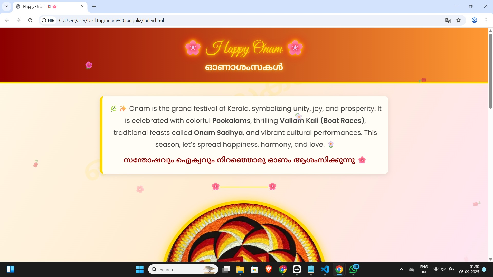
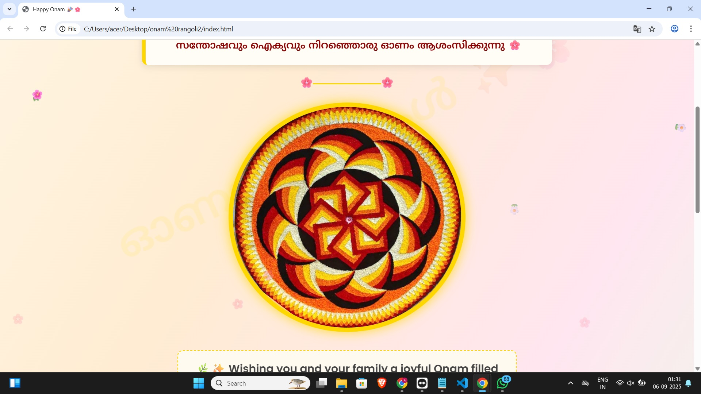
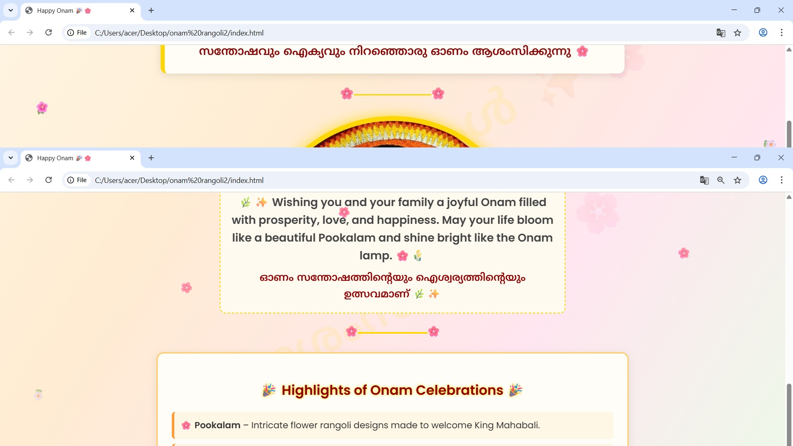
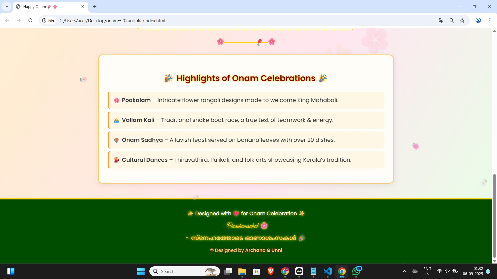

# <h1 align="center">

# &nbsp; 🌸✨ Happy Onam Project ✨🌸

# </h1>

# 

# <p align="center">

# &nbsp; 

# </p>

# 

# ---

# 

# \## 🌺 About the Project

# This is a \*\*creative Onam-themed webpage\*\* made with \*\*HTML, CSS \& JavaScript\*\*, inspired by Kerala’s traditions.  

# It’s not just a website—it’s an \*\*experience of Onam vibes\*\* with animations, effects, and cultural highlights! ✨  

# 

# ---

# 

# \## 🎨 Features

# \- 🌸 \*\*Vibrant Pookalam Design\*\* with glowing effects  

# \- 🌼 \*\*Falling Flowers Animation\*\* for festive vibes  

# \- 🚣 \*\*Smooth Scroll + Transitions\*\* for interactivity  

# \- 📱 \*\*Fully Responsive UI\*\* (works on mobile \& desktop)  

# \- 🎥 \*\*Snapshots \& Video Preview\*\* for quick look  

# 

# ---

# 

# \## 📸 Snapshots  

# 

# <p align="center">

# &nbsp; 

# &nbsp; <br><br>

# &nbsp; 

# &nbsp; <br><br>

# &nbsp; 

# <br><br>

#   

# </p>

# 

# ---

# 

# \## 🎥 Video Preview  

# 

# <p align="center">

# &nbsp; 

# </p>

# 

# <p align="center">

# &nbsp; 👉 <a href="videos/video1.mp4">Click Here to Watch the Demo</a> 👈

# </p>

# 

# ---

# 

# \## 🚀 Tech Stack

# \- ⚡ \*\*HTML5\*\* – structure  

# \- 🎨 \*\*CSS3\*\* – animations, gradients, festive design  

# \- 🌐 \*\*JavaScript\*\* – falling flowers \& interactivity  

# 

# ---

# 

# \## 🛠️ Installation  

# 

# ```bash

# \# Clone this repository

# git clone https://github.com/your-username/your-repo-name.git

# 

# \# Navigate into the project folder

# cd your-repo-name

# 

# \# Open in browser

# index.html


